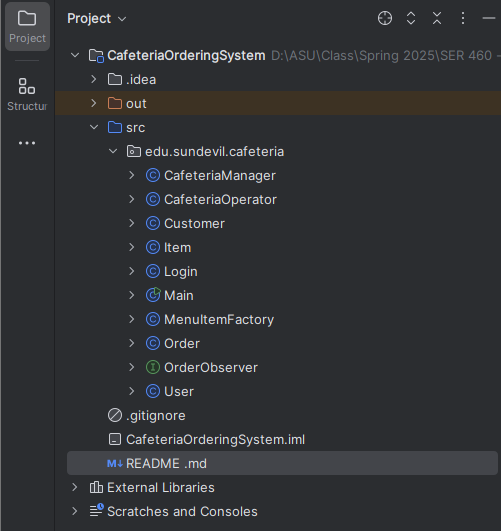

# Sundevil Cafeteria Online Ordering System (Phase I)

This is the **Phase I implementation** of the Sundevil Cafeteria Online Ordering System, designed using Java and object-oriented principles. It simulates the basic operations of a digital cafeteria service, allowing different user roles to interact with a simplified backend structure.

---

## 📌 Overview

This system supports the following key features:

- **Customer**: Places orders and tracks their status.
- **Cafeteria Manager**: Adds or removes items from the menu.
- **Cafeteria Operator**: Updates order status and availability.
- **Order Management**: Tracks items and uses the Observer pattern for live updates.
- **Factory Pattern**: Used to generate new menu items.
- **Login System**: Simple role-based authentication simulation.

---

## 🧱 Class Structure

### 🔸 Core Classes:
- `User`: Base class for all system users.
- `Customer`, `CafeteriaManager`, `CafeteriaOperator`: Subclasses of `User`.

### 🔸 Functional Classes:
- `Item`: Represents a menu item.
- `Order`: Represents an order placed by a customer.
- `OrderObserver`: Interface for observing order status.
- `MenuItemFactory`: Used by manager to create new menu items.
- `Login`: Handles user authentication and session control.

---

## 🚀 How to Run the Project

### 🛠 Requirements:
- Java 8+
- IntelliJ IDEA (or any Java IDE)

### ▶️ Run Instructions (IntelliJ):
1. Clone or download the project folder.
2. Open it in IntelliJ.
3. Run the `Main.java` file.

### 💬 Sample Output:
Order status: Ready

This indicates that the observer was successfully notified when the CafeteriaOperator updated the order.
## 📂 Project Structure
